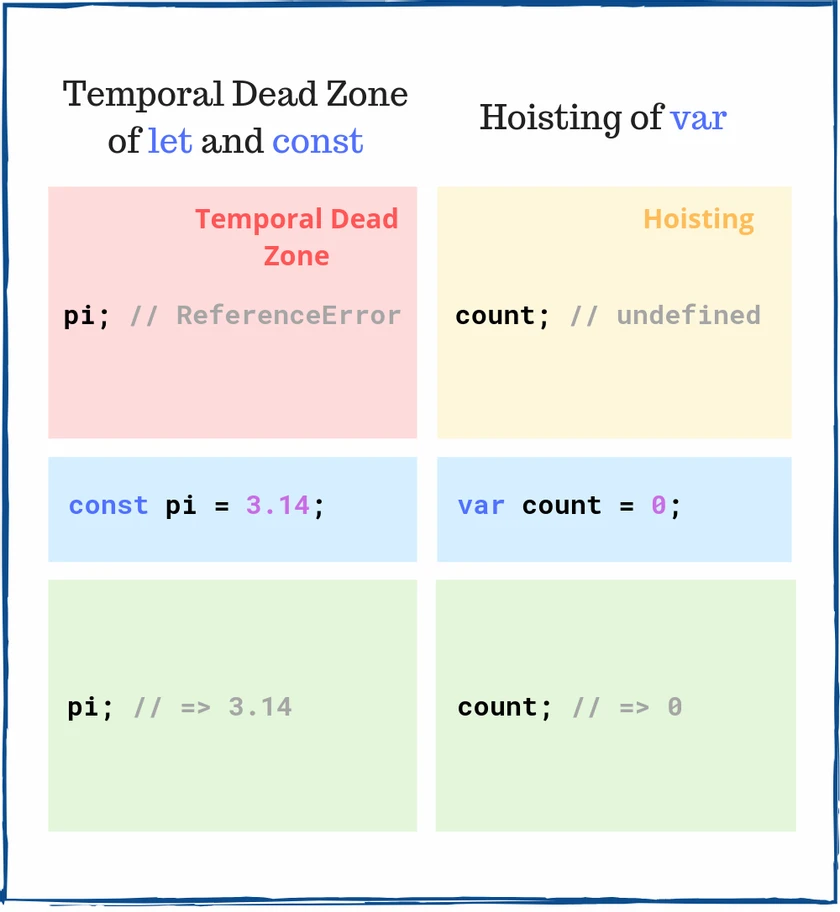

## Question 1. Hoisting
## What happens if you access myVar and myConst before declaration?

```js
    myVar;   // => ???
    myConst; // => ???

    var myVar = 'value';
    const myConst = 3.14;
 ```

<details><summary><b>Answer</b></summary>
Hoisting and temporal dead zone are 2 important concepts that influence the lifecycle of JavaScript variables.

<br/>

<!--  -->


Accessing myVar before declaration evaluates to undefined. A hoisted var variable, before its initialization, has an undefined value.

However, accessing myConst before the declaration line throws a ReferenceError. const variables are in a temporal dead zone until the declaration line const myConst = 3.14.

</details>

## Question 2. Swapping variables by destructuring.

<details><summary><b>Answer</b></summary>
    Without destructuring assignment, swapping two values requires a temporary variable (or, in some low-level languages, the XOR-swap trick).
<br/>

```js 
let a = 1;
let b = 3;

[a, b] = [b, a];
console.log(a); // 3
console.log(b); // 1

const arr = [1,2,3];
[arr[2], arr[1]] = [arr[1], arr[2]];
console.log(arr); // [1,3,2]

```
</details>


## Question 3. Primitive vs no-primitive.

<details><summary><b>Answer</b></summary>
1 Primitive values are immutable. they can be reassigned

<br/>

```js 

/**
 *Primitive values are copied by value
 */
function primitiveMutator(val) {
    val = val + 1;
}
let x = 1;
primitiveMutator(x);
console.log(x); // 1


/**
 *Non-primitive values are copied by reference
 */
function objectMutator(val) {
    val.prop = val.prop + 1;
}
let obj = { prop: 1 };
objectMutator(obj);
console.log(obj.prop); // 2


```


2 Primitive values (except for the mystical NaN value) will always be exactly equal to another primitive with an equivalent value
```js 
const first = "abc" + "def";
const second = "ab" + "cd" + "ef";
console.log(first === second); // true
```

However, constructing equivalent non-primitive values will not result in values which are exactly equal

```js
const obj1 = { name: "Intrinsic" };
const obj2 = { name: "Intrinsic" };
console.log(obj1 === obj2); // false
// Though, their .name properties ARE primitives:
console.log(obj1.name === obj2.name); // true
```


</details>


## Question 4. Implementing our own Array.map() method in javascript.

<details><summary><b>Answer</b></summary>

```js
Array.prototype.mymap = function (callback) {
    const resultArray = [];
    for (let index = 0; index < this.length; index++) {
        resultArray.push(callback(this[index], index, this));
    }
    return resultArray;
}

/**
 * `this` refers to the array on whichmymap is done. `this` is the array * itself
 * */ 

const sample = [1, 2, 3]

sample.mymap(val => console.log(val)) //1,2,3
```
</details>
